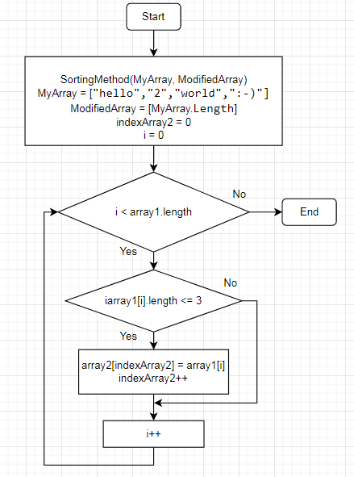

# Описание решения задачи.

1.  Зададим массив строк _MyArray_ из первого примера:
**["hello","2","world",":-)"]**.
2.  Зададим пустой массив _ModifiedArray_ аналогичной длины, что и _MyArray_.
3.  Напишем метод **_SortingMethod_**, который на вход принемает 2 заданных массива.
Метод с помощью цикла **for** "пробегает" массив _MyArray_ и оператором **if** (с условием - длина строк меньше, либо равна 3 символам) вычленяет строки соответсвующего размера.
Отсортированную строку записываем в первый элемент массива _ModifiedArray_ за индекс которого отвечает переменная _indexArray2_, которая увеличивается +1 при каждом выполнении условия.
4.  Для наглядности выводим заданные массивы и массив получившийся после работы метода.
5.  Блок-схема:
